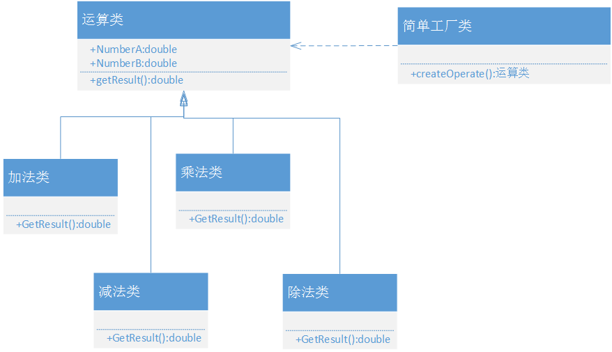
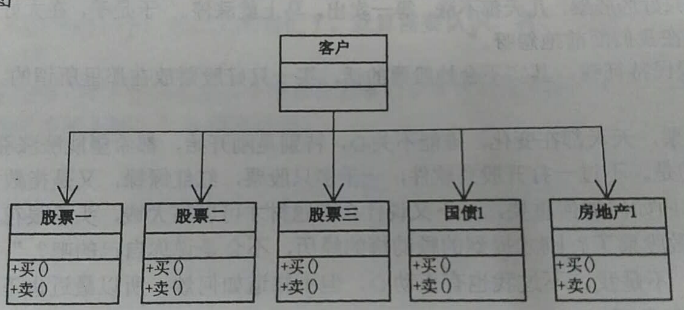
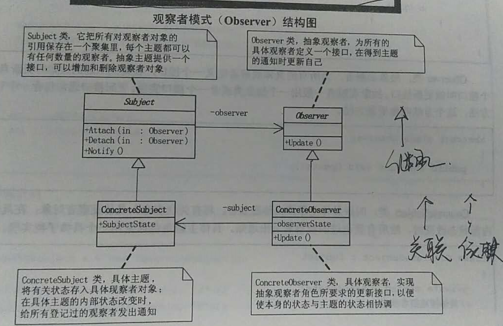

## 设计模式原则

### 1. 单一职责原则
* **就一个类而言，应该仅有一个引起它变化的原因**。

* 如果一个类承担的职责过多，就等于把这个职责耦合在一起，一个职责的变化可能会削弱或者抑制这个类完成其他职责的能力。

* 软件设计真正要做的许多内容，就是发现职责并把那些职责相互分离。

### 2. 开放——封闭原则
* **软件实体（类、模块、函数）应该可以扩展，但是不可修改**。

* 对于扩展是开放的（open for extension），对于更改是封闭的(closed for mmodification)。

* 在我们最初编写代码时，假设变化不会发生。当变化发生时，我们就创建抽象来隔离以后发生的同类变化。

### 3. 依赖倒转原则
* **A 高层模块不应该依赖低层模块，两个都应该依赖抽象**。
* **B 抽象不应该依赖细节。细节应该依赖抽象**。

* 说白了，就是要针对接口编程，不要对实现编程。

### 4. 里氏代换原则（LSP）
* **子类型必须能够替换掉它们的父类型**。

* 也就是说，在软件里面，把父类都替换成它的子类，程序的行为没有变化。

* 只有当子类可以替换掉父类，软件单位的功能不受影响时，父类才能真正补复用，而子类也能够在父类的基础上增加新的行为。

### 5. 迪米特法则（LoD）
* **如果两个类不必彼此直接通信，那么这两个类就不应当发生直接的相互作用。如果其中一个类需要调用另一个类的某一个方法的话，可以通过第三者转发这个调用**。

* 迪米特法则其根本思想，是强调了类之间的松耦合。类之间的耦合越弱，越有利于复用，一个处在弱耦合的类被修改，不会对有关系的类造成波及。

### 6. 合成/聚合复用原则
* **尽量使用合成聚合，尽量不要使用类继承**。

* 聚合表示一种弱的‘拥有’关系，体现的是A对象可以包含B对象，但B对象不是A对象的一部分；

* 合成则是一种强的‘拥有’关系，体现了严格的部分和整体的关系，部分和整体的生命周期一样。

## 设计模式
### 1. 简单工厂模式
* 演变：小菜设计一个计算器程序，可以灵活增加算法如开根号，也就是说到底要增加什么运算这是容易变化的地方，应该考虑用一个单独的类来做这个创造实例的过程，这就是工厂类。

### 2. 策略模式
* 演变：小菜设计一个商场收银软件，输入单价和数量进行收费。考虑打折、满200减100等活动。

* 可以用简单工厂实现如下：

* 简单工厂模式只是解决了对象的创建问题，而且由于工厂方法本身包括了所有的收费方式，商场可能是经常性更改打折和反利额度，每次维护都要改动工厂。面对算法的时常变动，应该用策略模式：

* 用策略模式重新实现如下：

* **策略模式是一种定义一系列算法的方法，从概念上来看，所有这些算法完成的都是相同的工作，只是实现不同，它们可以以相同的方式调用所有的算法，减少了各种算法类与使用算法类之间的耦合**。

### 3. 装饰器模式
* 演变：要求写一个给人搭配不同服饰的系统，要能灵活的增加种种装扮，小菜设计如下：

* 现在存在的问题是，应该在内部组装完毕再显示出来，穿衣服也有顺序，需要把所需的功能按照正确的顺序串联起来：

* 小菜第三版设计如下：

* 装饰器模式就是为已有功能动态地添加更多功能的一种方式。
* 当系统需要新功能的时候，是向旧的类中添加新的代码。这些新加的代码通常装饰了原有类的核心职责或主要行为。
* 装饰器模式的优点，把类中的装饰功能从类中搬移去除，这样可以简化原有的类。

### 4. 代理模式
* 演变：试着写一个小明追求娇娇的程序，娇娇不认识小明，实际情况应该是追求者通过代理人给娇娇送礼物，才是合理的。娇娇不认识追求她的人，但却可以通过代理人得到礼物：

* 代理模式为其他对象提供一种代理以控制对这个对象的访问。

* 代理的应用场合：
    ##### 1. **远程代理**，也就是为一个对象在不同的地址空间提供局部代表。
    ##### 2. **虚拟代理**，是根据需要创建开销很大的对象，通过它来存放实例化需要很长时间的真实对象。
    ##### 3. **安全代理**，用来控制真实对象访问时的权限。
    ##### 4. **智能指引**，是指当调用真实对对象时，代理另外一些事。

* **代理模式其实不是在访问对象时引入一定的间接性，因为这种间接性，可以附加多种用途。说的了代理就是真实对象的代表**。

### 5. 工厂方法模式
* 演变：小菜不明白简单工厂模式与工厂方法模式的区别，比如之前做的计算器例子：

* 简单工厂模式的最大优点在于工厂类中包含了必要的逻辑判断，根据客户商的选择条件动态实例化相关的类。

* 如果换成工厂方法模式来写这个计算器：

* 工厂方法模式，定义一个用于创建对象的接口，让子类决定实例化哪一个类。工厂方法使一个类的实例化延迟到其子类。

* **也就是说，工厂方法把简单工厂的内部逻辑判断移到了客户端代码来进行。你想要加功能，本来是改工厂类的，而现在是修改客户端**。

### 6. 原型模式
* 演变：我出个需求你写写看，要求有一个简历类，必须要有姓名，可以设置性别和年龄，可以设置工作经历。最终我需要三份简历。

* 如果是写一个类进行实例化，那如果要二十份就要实例化二十次。

* 原型模式，用原型实例指定创建对象的种类，并且通过拷贝这些原型创建新的对象。

### 7. 模板方法模式
* 演变：“题目抄错了，那就不是考试题目了，而考试试卷最大的好处就是，大家的题目都是一样的” “这其实就是一个设计模式，你先把抄题目的程序写出来看看”

* 小菜第一版作业：

* 学生甲和乙两个抄试卷非常类似，除了答案不同。可以用继承，所有重复的代码都应该要上升到父类去，而不是让每个子类都去重复。

* 小菜第二版作业：

* 模板方法，定义一个操作中的算法骨架，而将一些步骤延迟到子类中。模板方法使得子类可以不改变一个算法的结构即可重定义该算法的某些特定步骤。

* **模板方法模式是通过把不变行为搬移到超类，去除子类中的重复代码来体现它的优势**。

* **当不变的和可变的行为在方法的子类实现中混合在一起时，不变的行为就会在子类中重复出现。我们通过模板方法模式把这些行为搬移以单一的地方，这样就帮助子类摆脱重复的不变行纠缠**。

### 8. 外观模式
* 演变：小菜写出股民投资炒股代码看看。

* 如果要增加基金类，将如何做？

* 外观模式，为子系统中的一组接口提供一个一致的界面，此模式定义了一个高层接口，这个接口使得这一子系统更加容易使用。

### 8. 建造者模式
* 演变：要求用程序画一个小人，这在游戏程序里常见，现在简单点，要求是小人有头、身体、两手、两脚。

* 如果用drawLine()函数实现，那么总是会忘记缺少线条。

* 仔细分析，这里建造小人的过程是稳定的，都需要头身手脚，而具体建造的细节是不同的，有胖有瘦有高有矮。

* 将一个复杂对象的构建与它的表示分离，使得同样的构建过程可以创建不同的表示时，我们需要**建造者模式**。

* 如果我们用了建造者模式，那么用户就只需要指定需要建造的类型就可以得到它们，而具体的建造过程和细节就不需要知道了。

* 建造都模式的结构如下：

* **建造者模式是在当创建复杂对象的算法应该独立于该对象的组成部分以及它们的装配方式时适用的模式**。

### 9. 观察者模式
* 演变：同事在上班期间看股票，如果老板回来就让前台打电话来通知。这个情形就是一个典型的观察者模式。

* 观察者模式定义了一种一对多的依赖关系，让多个观察者对象同时监听某一个主题对象。这个主题对象在状态发生变化时，会通知所有观察者对象，使它们能够自动更新自己。

* 观察者模式的关键对象是主题Subject和观察者Observer，一个Subject可以有任意数目的依赖它的Observer，一旦Subject的状态发生了改变，所有的Observer都可以得到通知。Subject发出通知时并不需要知道谁是它的观察者，也就是说，具体观察者是谁，它根本不需要知道。而任何一个具体观察者不知道也不需要知道其它观察者的存在。

* 什么时候使用观察者模式，当一具对象的改变需要同时改变其他对象的时候，面且它不知道具体有多少对象有待改变时，应该考虑使用观察者模式。

### 10. 抽象工厂模式
* 演变：公司数据库由Access换成SQLServer，你先写一段原来的数据访问做法来看看，就用‘新增用户’和‘得到用户’为例吧。

* 你的数据库里不可能只有一个User表吧，很可能有其他表，比如增加部门(Department)，此时如何办？

* 只有一个User类和User操作类时，是只需要工厂方法模式的，但现在显然你的数据库中有很多的表，而SQL Server与Access双是两大不同的分类，所以解决这种涉及多个产品系列的问题，有一个专门的工厂模式叫抽象工厂模式。

* **抽象工厂模式，提供一个创建一系列相关或相互依赖对象的接口，而无需指定它们具体的类**。

* AbsbractProductA和AbstractProductB是两个抽象产品，之所以为抽象，是因为它们都有可能有两种不同的实现，就刚才的例子来说是USer和Department。IFactory是一个抽象工厂接口，它里面应该包含所的产品创建的抽象方法，而ConcreteFactory1和ContreteFactory2就是具体的工厂了。

### 11. 状态模式
* 演变：“你刚才讲到，上午状态发困，中午想睡觉，下午渐恢复，加班煎熬。其实是一种状态的变化，不同的时间，会有不同的状态，你现在用代码实现一下”。

* **状态模式，当一个对象的内在状态改变时允许改变其行为，这个对象看起来像是改变了其类**。

* 状态模式主要解决的是当前控制一个对象状态转换的条件表达式过于复杂的情况，把状态的判断逻辑移到表示不同的一系列类当中，可以把复杂的判断逻辑简化。

* 状态模式的好处是将与特定状态相关的行为局部化，并且将不同的状态行为分割开。

* 状态模式通过把各种状态转移逻辑分布到State的子类之间，来减少相互间的依赖。

* **当一个对象的行为取决于它的状态，并且它必须在运行时刻根据状态改变它的行为时，就可以考虑使用状态模式了**。

* 半小时后，小菜写出的代码如下：

### 12. 适配器模式
* 演变：姚明在NBA，特别是比赛场上，教练，队员，与他的对话全是通过翻译来沟通的。如果不懂外语，又没有翻译，球技再高，估计也是不可能在国外待很长时间的。

* **适配器模式，将一个类的接口转换成客户希望的另外一个接口。Adapter模式使得原本接口不兼容而不能一起工作的那些类可以一起工作**。

* 系统的数据和行为都正确，但接口不符时，我们应该考虑用适配器，目的是使用控制范围之外的一个原有对象与某个接口匹配。适配器模式主要应用于希望复用一些现存的类，但是接口又与复用环境要求不一致的情况。

* 使用一个已经存在的类，但如果它的接口，也就是它的方法和你的要求不相同时，就应该考虑用适配器模式。

### 13. 备忘录模式
* 演变：“我简单说个场景，你想想看用代码怎么实现。游戏的某个场景，一游戏角色有生命力、攻击力、防御力等数据，在打Boss前和后一定会不一样，我们允许玩家感觉与Boss决斗的效果不理想可以让游戏恢复到决斗前”

* 备忘录：在不破坏封装性的前提下，捕获一个对象的内部状态，并在该对象之外保存这个状态。这样以后该对象恢复到原先保存的状态。

* 游戏进度备忘录：

### 14. 组合模式
* 演变：做一个公司的办公管理系统，总部有人力资源、财务、运营部门。现在的问题是总公司的人力资源部、财务部等办公管理功能在所有分公司都需要有。而且总部和分部是成树状结构，也就是有组织结构，不可以简单平行管理。

* 组合模式，将对象组合成树形结构以表示‘部分-整体’的层次结构。组合模式使得用户对单个对象和组合对象的使用具有一致性。

* 当你发现需求中是体现部分与整体层次的结构时，以及你希望用户可以忽略组合对象与单个对象的不同，统一地使用组合结构中的所有对象时，就应该考虑使用组合模式。

* 小菜军民一致出公司管理系统的代码：

* 用户是不用关心到底是处理一个叶节点还是处理一个组合组件，也就用不着为定义组合而写一些选择判断语句了。

* 组合模式让客户可以一致地使用组合结构和单个对象。

### 15. 迭代器模式
* 演变：售票员对所有上车的乘客都进行收费，就是把办车厢里的所有乘客都遍历了一遍。

* **迭代器模式：提供一种方法顺序访问一个聚合对象中各个元素，而又不暴露该对象的内部表示**。

* 你需要对聚集有多种方式遍历时，可以考虑用迭代器模式。

* 该模式实用价值不大，因为现在的高级编程语言如Java等本身已经把这个模式做在语言中了。

### 16. 单例模式
* 单例模式，保证一具类仅有一个实例，并提供一个访问它的全局访问点。

* **通常我们可以让一个全局变量使得一个对象被访问，但它不能防止你实例化多个对象。一个最好的方法就是，让类自身负责保存它的唯一实例。这个类可以保证没有其他实例可以被创建，并且它可以提供一个访问该实例的方法**。

*　单例模式因为Singleton类封装它的唯一实例，这样它可以严格地控制客户怎样访问以及何时访问它。简单地说就是对唯一实例的受控访问。

### 17. 桥接模式
* 演变：现有一个N品牌和M品牌的手机，都有游戏和通讯录功能，客户端可以调用怎么做？

* 如果每个品牌都增加一个MP3音乐播放功能，如何做？

* “我觉得应该是手机品牌包含有手机软件，但软件并不是手机的一部分”

* **应该优先使用对象的合成或聚合，而不是类继承（合成/聚合复用原则）。所以我们在用继承时，一定要在是‘is-a’的关系时再考虑使用，而不是任何时候都去使用**。

* **桥接模式，将抽象部分与它的实现部分分离，使它们都可以独立地变化**。

* 什么叫抽象与它的实现分离，这并不是说，让抽象类与其派生类分离，因为这没有任何意义。实现指的是抽象类和它的派生类用来实现自己的对象。

* ‘将抽象部分与它的实现部分分离’，还是不好理解，我的理解就是**实现系统可能有多角度分类，每一种分类都有可能变化，那么就把这种多角度分离出来让它们独立变化，减少它们之间的耦合**。

### 18. 命令模式
* 演变：烧烤摊与烧烤店的区别，菜用代码写出来：

* 很好这就是路边烤内的对应了，如果用户多了，请求多了就容易乱。那你再尝试用门店的方式来实现它。

* 命令模式，**将一个请求封装为一个对象，从而使你可用不同的请求对客户进行参数化；对请求排队或记录请求日志，以及支持可撤销的操作**。

* 命令模式把请求一个操作的对象与知道怎么执行一个操作的对象分割开。

### 19. 职责链模式
* 演变：小菜申请加薪，向经理申请，经理没权利向总监上报，总监也没权利向总经理上报，写成代码。

* 职责链模式：**使多个对象都有机会处理请求，从而避免请求的发送者和接收者之间的耦合关系。将这个对象连成一条链，并沿着这条链传递该请求，直到有一个对象处理它为止**。

* 当客户提交一个请求时，请求是沿链传递直到有一个ConcreteHandler对象负责处理它。

* 请求者不用管哪个对象来处理，反正该请求会被处理就对了。接收者和发送者都没有对方的明确信息，且链中的对象自己也并不知道链的结构。结果是职责链可简化对象的相互连接，它们仅需保持一个指向其后继承者的引用，而不需要保持它所有的候选接受者的引用。

* 加薪代码如下：

### 20. 中介者模式
* 演变：中介者模式又叫调停模式或者中间人模式。比如伊朗问题、朝鲜问题，由于各国之间代表的利益不同，所以矛盾冲突是难免的，但联合国组织就是一个调停者、中介者的角色。

* 尽管将一个系统分割成许多对象通常可以增加其可复用性，但是对象之间相互连接的激增又会降低其可复用性。

* ‘迪米特法则’，如果两个类之间不必彼此直接通信，那么这两个类就不应当发生直接的相互作用。

* **中介者模式，用一个中介对象来封装一系列的对象交互。中介者使各对象不需要显式地相互引用，从而使其耦合松散，而且可以独立地改变它们之间的交互**。

* 中介者模式很容易在系统中应用，也很容易在系统中误用。当系统中出现了‘多对多’交互复杂的对象群时，不要急于使用中介者模式，而要先反思你的系统在设计上是不是合理。

### 21. 享元模式
* 演变：小菜帮别人做网站，有的希望是做新闻类，有的人希望是做博客类，如何维护。

* **享元模式(Flyweight)，运用共享技术有效地支持大量细粒度的对象**。

* 享元模式可以避免大量非常相似类的开销。在程序设计过程中，有时需要生成大量细粒度的类实例来表示数据。如果能发现这些实例除了几个参数外基本上都是相同的，有时就能够受大幅度地减少需要实例化的类的数量。如果能把那些参数移到类实例的外面，在方法调用时将它们传进来，就可以通过共享大幅度地减少单个实例的数目。

* 小菜的代码如下：

* **如果一个应用程序使用了大量的对象，而大量的这些对象造成了很大的存储开销时就应该考虑使用享元模式；还有就是对象的大多数状态可以外部状态，如果删除对象的外部状态，那么可以用相对较少的享元对象取代很多组对象，此时可以考虑使用享元模式**。

### 22. 解释器模式
* 解释器模式，给定一个语言，定义它的方法的一种表示，并定义一个解释器，这个解释器使用该表示来解释语言中的句子。

* 如果一种特定类型的问题发生的频率足够高，那么可能就值得将该问题的各个实例表述为一个简单语言的句子。这样就可以构建一个解释器，该解释器通过解释这些句子来解决问该问题。

* 解释器模式就是用‘迷你语言’来表示程序要解决的问题。当有一个语言需要解释执行，并且你可将该语言中的句子表示为一个抽象语法树时，可使用解释器模式。

* 写一个音乐解释器如下：

### 23. 访问者模式
* 演变：男人和女人成功时、失败时、恋爱时有不同的表现。

* **访问者模式，表示一个作用于某对象结构中的各元素的操作。它使你可以在不改变各元素的类的前提下定义作用于这些元素的新操作**。

* 它把数据结构和作用于结构上的操作之间的耦合解脱开，使得操作集合可以相对自由地演化。

* 访问模式的优点就是增加新的操作很容易，因为增加新的操作就意味着增加一个新的访问者。访问者模式将有关的行为集中到一个访问者对象中。

* 大多数时候你并不需要访问者模式，但当你一旦需要访问者模式时，那就是真的需要它了。
